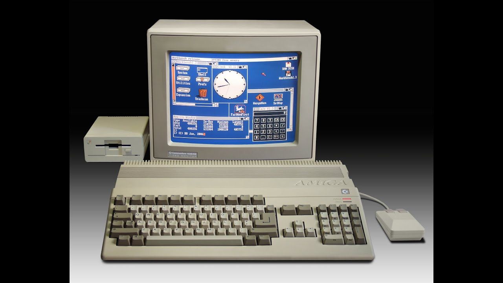

# The Greatest Computer of All Time 🖳
Here lies the all the information you need to finally make the obvious choice to purchase the Commodore Amiga 500!
!

Here it is! in all its elegance and glory, the historical past monarch of computing technology, The magnificient antiquity that graced the computer world with new innovation and incredible specs. I can't even compare my disqusting atrocius modern computers' terrible function and specs to its grand stature. If I havent already convinced you to purchase this absolute treasure of a computer, hopefully its extremely reasonable and cheap price of 1,670 dollars (to adjust for inflation) will prove you otherwise. If you aren't already violently shaking in your seat and looking to purchase this computer on Amazon I will unfortunately have to inform you that the computer is discontinued due to the corruption of modern computer companies attempting to make worse computers for more profit. Still not convinced, these specs be mad fact spitting yo Commodore Amiga we stan.

So, to start off, my computer is a dell with these abismal specs

